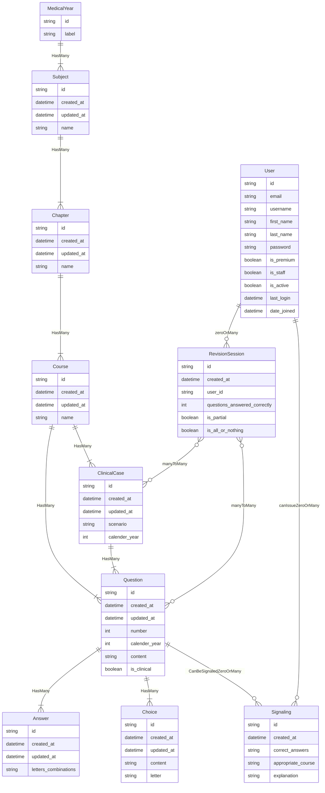

```mermaid
erDiagram

    User {
        string id
        string email
        string username
        string first_name
        string last_name
        string password
        boolean is_premium
        boolean is_staff
        boolean is_active
        datetime last_login
        datetime date_joined
    }

    MedicalYear {
        string id       
        string label
    }

    Subject {
        string id
        datetime created_at
        datetime updated_at
        string name 
    }

    Chapter {
        string id
        datetime created_at
        datetime updated_at
        string name
    }

    Course {
        string id
        datetime created_at
        datetime updated_at
        string name
    }


    ClinicalCase {
        string id
        datetime created_at
        datetime updated_at
        string scenario
        int calender_year
    }

    Question {
        string id
        datetime created_at
        datetime updated_at
        int number
        int calender_year
        string content
        boolean is_clinical
    }

    Answer {
        string id
        datetime created_at
        datetime updated_at
        string letters_combinations
    }

 
    Choice {
        string id
        datetime created_at
        datetime updated_at
        string content 
        string letter
    }

    RevisionSession {
        string id
        datetime created_at
        string user_id
        int questions_answered_correctly
        boolean is_partial
        boolean is_all_or_nothing
    }

    Signaling {
        string id
        datetime created_at
        string correct_answers
        string appropriate_course
        string explanation 
    }

    MedicalYear ||--|{ Subject : HasMany
    Subject ||--|{ Chapter : HasMany
    Chapter ||--|{ Course : HasMany
    Course ||--|{ Question : HasMany
    Course ||--|{ ClinicalCase : HasMany
    ClinicalCase ||--|{ Question : HasMany
    Question ||--|{ Answer : HasMany
    Question ||--|{ Choice : HasMany


    User || -- o{ RevisionSession : zeroOrMany
    RevisionSession }o--o{ Question :manyToMany 
    RevisionSession }o--o{ ClinicalCase : manyToMany 

    Question || -- o{ Signaling : CanBeSignaledZeroOrMany
    User || -- o{ Signaling : canIssueZeroOrMany

   
```